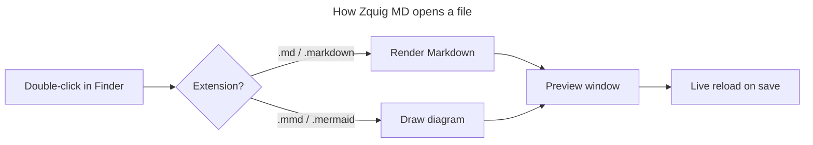

```mermaid
---
title: How Zquig MD opens a file
---
flowchart LR
    A[Double-click in Finder] --> B{Extension?}
    B -->|.md / .markdown| C[Render Markdown]
    B -->|.mmd / .mermaid| D[Draw diagram]
    C --> E[Preview window]
    D --> E
    E --> F[Live reload on save]

```
